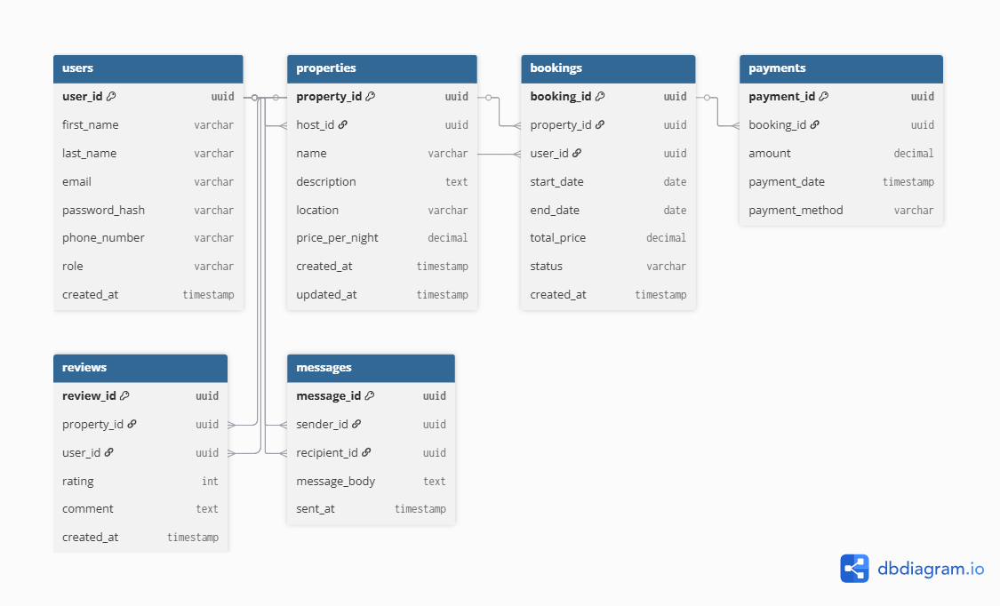

# Entity-Relationship Diagram (ERD)

## Objective
This document defines the entities and relationships for the Airbnb Database System.

## Entities and Attributes
- **User**
  - user_id (PK)
  - first_name
  - last_name
  - email
  - password_hash
  - role
  - created_at

- **Property**
  - property_id (PK)
  - host_id (FK → User.user_id)
  - name
  - location
  - price_per_night
  - created_at

- **Booking**
  - booking_id (PK)
  - property_id (FK → Property.property_id)
  - user_id (FK → User.user_id)
  - start_date
  - end_date
  - total_price

- **Payment**
  - payment_id (PK)
  - booking_id (FK → Booking.booking_id)
  - amount
  - payment_method
  - payment_date

- **Review**
  - review_id (PK)
  - property_id (FK → Property.property_id)
  - user_id (FK → User.user_id)
  - rating
  - comment
  - created_at

- **Message**
  - message_id (PK)
  - sender_id (FK → User.user_id)
  - recipient_id (FK → User.user_id)
  - message_body
  - sent_at

## Relationships
- A **User** can host multiple **Properties**.
- A **User** can make multiple **Bookings**.
- Each **Booking** is linked to one **Property** and one **User**.
- Each **Payment** belongs to one **Booking**.
- A **User** can leave multiple **Reviews** for different **Properties**.
- **Messages** are exchanged between **Users** (sender and recipient).

## ERD Image
The visual diagram is provided below:

